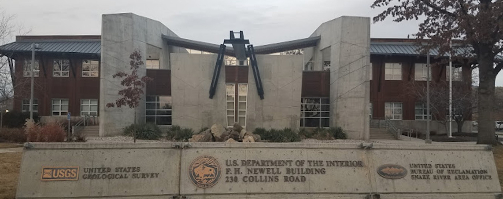
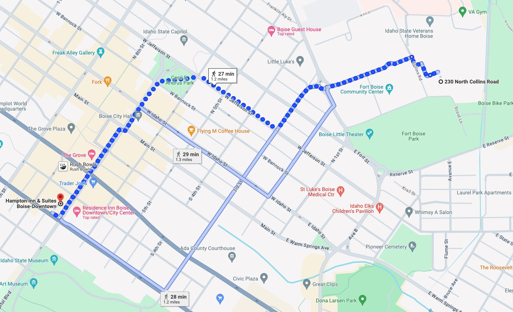

# U.S. Geological Survey Class GW3099
Advanced Modeling of Groundwater Flow (GW3099)\
Boise, Idaho\
September 16 - 20, 2024

## Location
* Classroom: USGS Idaho Water Science Center-Newell Building Training Room-Boise, Idaho, USGS Idaho Water Science Center (IDWSC), 230 Collins Road, Boise, Idaho, 83702

* Hotel Block: Hampton Inn & Suites Boise-Downtown, 495 S Capitol Blvd., Boise, Idaho 83702

The hotel is 1.2 miles from the Idaho Water Science Center.

## Course Description
This class will cover many of the advanced MODFLOW 6 capabilities and provide an overview of PEST++ parameter estimation and uncertainty analysis using PEST++. Most of the class will be taught using Flopy and Jupyter Notebooks.  In addition to lectures, most sessions will include in-class exercises to give attendees a better understanding of how to use the modeling tools.

## Overview
* **Monday**: Getting started, Structured and unstructured grids (DIS, DISV, DISU) and LGR; XT3D; Advanced packages (LAK, SFR, MAW, UZF, MVR)
* **Tuesday**: NetCDF; Groundwater Transport (GWT) and associated advanced packages (SFT, UZT, *etc.*), Buoyancy (BUY) and Viscosity (VSC); Groundwater Energy (GWE) and associated advanced packages (SFE, UZE, *etc.*)
* **Wednesday**: Solver settings; Particle Tracking (PRT); Skeletal Storage, Compaction, and Subsidence (CSUB) Package; MODFLOW API
* **Thursday**: pywatershed; MODFLOW API - Coupling Models; Surface Water Flow (SWF); Parallel MODFLOW
* **Friday**: PEST++; Advanced Visualization

## Instructors
* Wes Bonelli
* Mike Fienen
* Joe Hughes 
* Chris Langevin
* Josh Larsen
* James McCreight
* Eric Morway
* Alden Provost
* Michael Reno

## Software

We will be using python during the class to build model datasets, run models, and post-process model results. The software has been installed on the USGS Hovenweep Supercomputer but it would be good to install the software The python on your laptop before the class. Software installation instructions for local installations are provided in [SOFTWARE.md](./SOFTWARE.md). Contact jdhughes@usgs.gov if you have any problems installing the class software.

## Agenda

The following tentative agenda is based on a start time each morning of 8:30 AM and an ending time each day of 4:30 PM.  The agenda may be adjusted during the week in response to student requests.

### Monday

|Time       |Topic                             |Duration, Lead                     |
|-----------|----------------------------------|-----------------------------------|
|8:30 AM    |Introductions and Class Overview  |30 Minutes, Hughes                 |
|9:00 AM    |FloPy for MODFLOW 6 Overview      |1 hour, Hughes                     |
|10:00 AM   |BREAK                             |15 minutes                         |
|10:15 AM   |Structured and Unstructured Grids |1 hour 45 minutes, Larsen          |
|12:00 PM   |LUNCH                             |1 hour 15 minutes                  |
|1:15 PM    |XT3D                              |1 hour, Provost                    |
|2:15 PM    |Advanced Packages Part 1          |1 hour, Hughes/Morway              |
|2:45 PM    |BREAK                             |15 minutes                         |
|3:00 PM    |Advanced Packages Part 2          |1 hour 30 minutes, Hughes/Morway   |
|4:30 PM    |ADJOURN                           |                                   |

### Tuesday

|Time       |Topic                             |Duration, Lead                     |
|-----------|----------------------------------|-----------------------------------|
|8:30 PM    |NetCDF Output                     |1 hour, Reno                       |
|9:30 AM    |GWT Part 1                        |1 hour, Langevin                   |
|10:30 PM   |BREAK                             |15 minutes                         |
|10:45 PM   |GWT Part 2                        |1 hour 15 minutes, Langevin        |
|12:00 PM   |LUNCH                             |1 hour 15 minutes                  |
|1:15 PM    |Buoyancy and Viscosity            |45 minutes, Langevin               |
|2:00 PM    |GWE Part 1                        |45 minutes, Morway/Provost         |
|2:45 PM    |BREAK                             |15 minutes                         |
|3:00 PM    |GWE Part 2                        |1 hour 30 minutes, Morway/Provost  |
|4:30 PM    |ADJOURN                           |                                   |

### Wednesday

|Time       |Topic                             |Duration, Lead                     |
|-----------|----------------------------------|-----------------------------------|
|8:30 AM    |Solver settings                   |1 hour, Hughes                     |
|9:30 AM    |PRT Part 1                        |1 hour, Bonelli/Provost            |
|10:30 AM   |BREAK                             |15 minutes                         |
|10:45 AM   |PRT Part 2                        |1 hour 15 minutes, Bonelli/Provost |
|12:00 PM   |LUNCH                             |1 hour 15 minutes                  |
|1:15 PM    |CSUB Package                      |1 hour, Hughes                     |
|2:15 PM    |MODFLOW API Part 1                |45 minutes, Hughes/Larsen          |
|3:00 PM    |BREAK                             |15 minutes                         |
|3:15 PM    |MODFLOW API Part 2                |1 hour 15 minutes, Hughes/Larsen   |
|4:30 PM    |ADJOURN                           |                                   |

### Thursday

|Time       |Topic                             |Duration, Lead                     |
|-----------|----------------------------------|-----------------------------------|
|8:30 AM    |pywatershed                       |2 hours, McCreight                 |
|10:30 AM   |BREAK                             |15 minutes                         |
|10:45 AM   |MODFLOW API - Coupling Models     |1 hour 15 minutes, Hughes/McCreight|
|12:00 PM   |LUNCH                             |1 hour 15 minutes                  |
|1:15 PM    |SWF                               |1 hour 15 minutes, Langevin        |
|2:30 PM    |Parallel MODFLOW Part 1           |30 minutes, Hughes/Larsen          |
|3:00 PM    |BREAK                             |15 minutes                         |
|3:15 PM    |Parallel MODFLOW Part 2           |1 hour 15 minutes, Hughes/Larsen   |
|4:30 PM    |ADJOURN                           |                                   |

### Friday

|Time       |Topic                             |Duration, Lead                     |
|-----------|----------------------------------|-----------------------------------|
|8:30  AM   |PEST++ Part 1                     |2 hours, Fienen                    |
|10:30 AM   |BREAK                             |15 minutes                         |
|10:45 AM   |PEST++ Part 2                     |1 hour 15 minutes, Fienen          |
|12:00 PM   |LUNCH                             |1 hour 15 minutes                  |
|1:15  PM   |Advanced Visualization            |2 hours, Bonelli/Langevin/Reno     |
|3:15  PM   |Wrap-up                           |30 minutes, All                    |
|3:45  PM   |ADJOURN                           |                                   |

